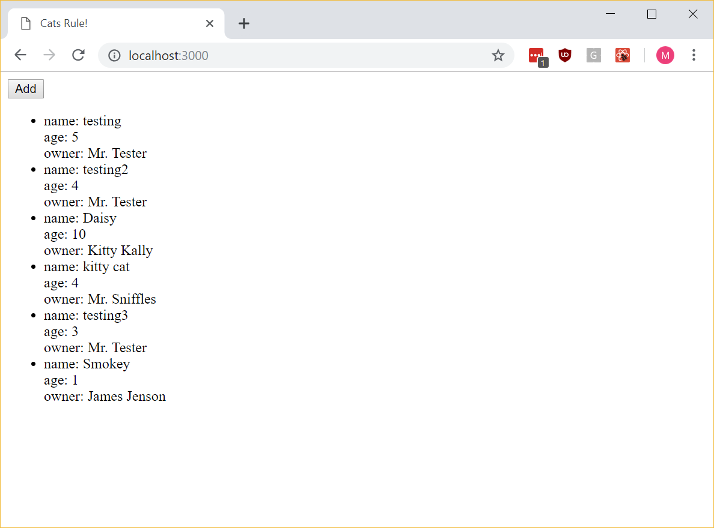
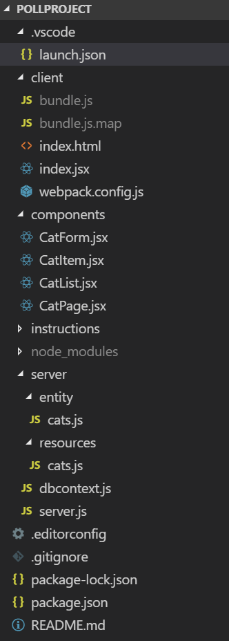
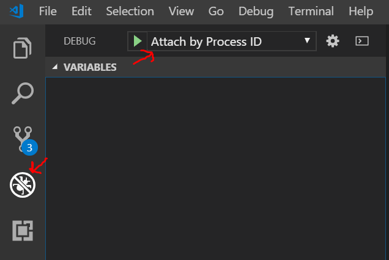
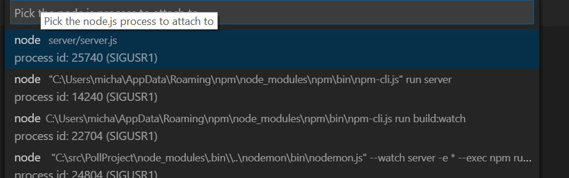
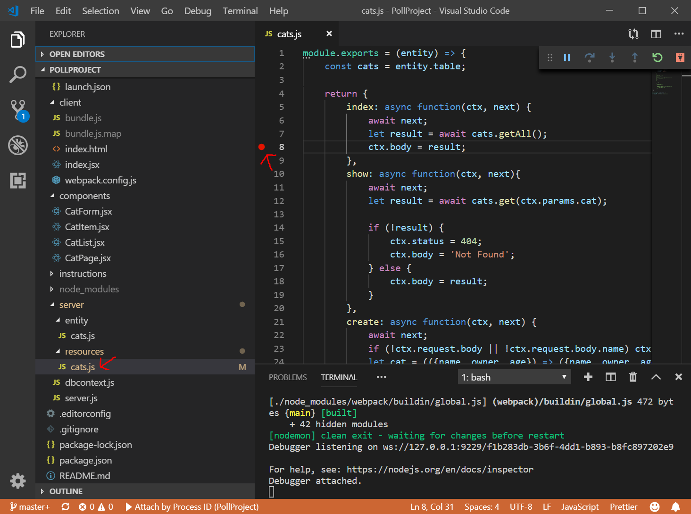
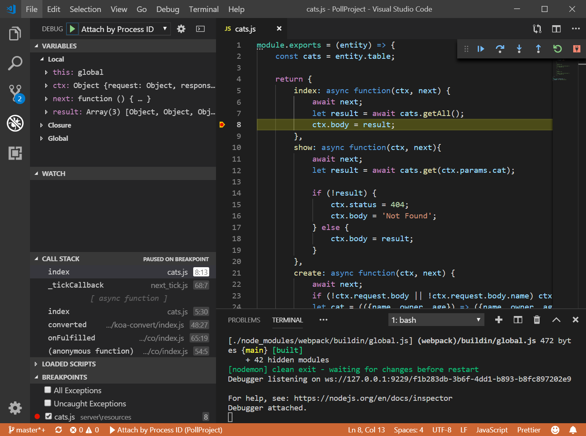

# Project Assignment: Polling App

## Background

We have an important event coming up. There will be a lot of technical people at this event, both employers and job seekers. We would like to get a sense of what technologies people are using in the field, so we get a better idea of what technologies we want to teach and use at XYZ Univeristy. We love web development, so let's create a web app to do this!

## Your Assignment

Create a web app to use for a poll.

**User**

We don't think that the general population will be interested in our poll, so your user will be Professor Smith from XYZ University who will be having conversations with event attendees. She will be entering the poll responses into the app.

**Requirements**

Professor Smith sat down with us last week and told us a little about what she is looking for. Let us relate to you now what she said. She wants to be able to talk to attendees and ask what technologies they use to manipulate the [Document Object Model](https://www.w3.org/TR/1998/WD-DOM-19980720/introduction.html). In particular, she wants to compare usage of HTML DOM, JQuery, Angular, and React. We asked her how she would like to compare usage. She told us that a simple count of attendees using each method will suffice. She wants the data to persist, so that she can come back to it later.

**Implementation**

We use React, so let's create a React application. It sounds like we need a list of technologies, and we want to be able to increment a counter for each technology. We know it is easy to make mistakes, so let's add the ability to decrement, too. Keep in mind, there can never be a negative count, so let's be sure to not allow a decrement below 0. We suggest that you set up DynamoDB locally, but if you want to use Mongo, [MLab](https://mlab.com/) is a good choice for MongoDB hosting.

**styling bonus**: You can try using [plus circle](https://fontawesome.com/icons/plus-circle?style=solid) and [minus circle](https://fontawesome.com/icons/minus-circle?style=solid) icons from [font-awesome](https://fontawesome.com/start) for some nice icons for the increment and decrement. If you have another icon solution you like (glyphicons, material-ui), feel free to try that instead.

[Let us know](https://github.com/un-loop/PollProject/blob/master/instructions/PART2.md) when you are finished.

# Notes

Your task will involve modifying your fork of the PollProject repository. If you take a look at the existing code, you will see that it is a simple app to show a list of cats with an option to add cats to the list. 

The first step you will need to take before running the app is ensuring your local DynamoDB instance is running. DynamoDB is a database service from amazon that runs in the cloud. We have not setup up a cloud service for this example, so you will need to have a service that you run locally on your machine to test against. Even if we did have a cloud service configured, testing against a local DB instance when developing is a very common development practice. You do not want to do your testing against a production database, and it's often expensive to have a test database in the cloud for every developer who will be developing your app. What this means is that you will need to be sure that your database service is started before you run your server. If you followed the previous instructions on setting up DynamoDB to run locally, this should be as simple as starting up a script.

Once your database service is running, you can start your app via ```npm start``` to start listening on port 3000. Browse to http://localhost:3000 to view the app an you should see something like:



## Project Structure

Let's take a moment to talk about the directory structure of the PollProject project.



You have the following top-level directories:
* .vscode

  Contains configuration files relevant to Visual Studio. You do not need to pay attention to this folder.

* client

  Contains the client facing code. Everything in this folder (except the webpack) is served as a static site. Since this is a single page app, we only have index.html, index.jsx, and bundle.js files.
  
* components

  Contains all of the React components we will use on the site.
  
* instructions

  Contains the files needed for the instructions that you are reading now. There is no code here.
  
* node_modules

  Contains all of the downloaded modules we depend on. These files are managed by npm.
  
* server

  Contains the server side code. server.js is our server that node will run to start our website. dbcontext.js is a file that configures the azure sdk to connect to our db and provides our database code with the objects needed to communicate with the sdk. You do not need to modify this file. We also have two subdirectories here.
  * entity
  
    Contains information about our entities (in this case, cats) so that we can interface with DynamoDB. We will talk more about this later.
  * resources
    Contains the code to implement a resource in our Rest API. More about this later when we talk about Rest APIs.
   
## Debugging

Debugging is an important part of software development. Visual Studio Code has a built-in [debugger](https://code.visualstudio.com/Docs/editor/debugging) to help you inspect your code for defects. It allows you to step through your code, line-by-line, inspect the state of your variables, set breakpoints, change the values of variables during execution, and more. Typically, when using the debugger, you will tell the debugger to "attach" to you server, so that it knows what code it should manage. Firstly, you will need to select the configuartion to use, "Attach by Process ID":



Once selected, you can press the green "play" arrow to attach to your process. You will need to have started your server via ```npm start``` for this to work.

The process you want to select is the one that reads "node server/server.js".



Once attached, you can set a breakpoint and start inspecting your code. Let's say that we are interested in inspecting the cats that are about to be returned when our front end code makes a request to our API. You can open up the file in your project at server/resources/cats.js and set a breakpoint at line 8 by clicking in the space just to the left of the line number "8".



If you now refresh you page at "http://localhost:3000" so that the page will request for the list of cats, your breakpoint will be hit.



At this point, you can head over to the debug view and inspect your variables to see what is the current value of the result variable. This is what we are about to set to the response body with the current statement ```this.body = result;```, and we can see that it contains the cats we expect.


This is just the briefest of introductions. Please refer to the [documentation](https://code.visualstudio.com/Docs/editor/debugging) for further information.

## Webpack

The PollProject (as do many React apps) uses [webpack](https://webpack.js.org/) to bundle and compile our [jsx](https://reactjs.org/docs/introducing-jsx.html) files. With webpack, we specify an entry point and a destination and webpack will 
collect up all of our script dependencies for our entry point, compile our jsx files with babel, and put all of our js into one file (called a "bundle" since all the js is "bundled" into one file). In our case, the entry point is client/Index.jsx, and the output is client/bundle.js. If you rename the Index.jsx file, or create a new entry point, you will need to add this entry point to the webpack.config.js. However, you should be able to complete the Polling App without making any changes here, as long as the Index.jsx file is not removed or renamed.


## Koa

[koa](https://koajs.com/) is a web framework for node.js. It is designed by the team behind [Express](https://expressjs.com/) and serves a similar function to Express, namely providing structured access to the node.js request and response objects to middleware and to route handlers (also middleware). Koa is lightweight and has no built-in middleware, though the koa community is huge and any number of middleware packages are available to include in your project. Unloop has developed a number of koa middleware packages that PollProject uses either directly or as an indirect dependency:
- [koa-decode-params](https://www.npmjs.com/package/koa-decode-params)

  Koa middleware to run all params through decodeURI
   
- [unloop-koa-query](https://www.npmjs.com/package/unloop-koa-query)

  Koa middleware for turning query params into a structured query object on ctx.dbQuery

- [unloop-resource-builder](https://www.npmjs.com/package/unloop-resource-builder)

  Builder for koa-resource-router using unloop's resorce/entity pattern. Access middleware by invoking `resource.middleware()`

- [unloop-static-router](https://www.npmjs.com/package/unloop-static-router)

  Koa static router with authorization
  
- [koa-auth-wrapper](https://www.npmjs.com/package/koa-auth-wrapper)

  A koa-passport cookie based session authorization that encrypts the session key and supplies login/logout routes with login redirection support. Access middleware by invoking `Auth.middleware()` from an object created from the exported class contructor.

- [koa-user-context](https://www.npmjs.com/package/koa-user-context)
  Koa middleware to set a user context cookie based on ctx.req.user set by koa-passport

By way of naming convention, any package name beginning with _koa-_ indicates a generic package, wherease a package name beginning with _unloop-_ indicates a package that makes assumptions concerning the structure of your project that may only hold inside of Unloop. Review the [documentation](https://koajs.com) for more information on koa and how koa is used. Pay particular attention to the ctx (context) object, as this is central to the koa paradigm.

## Rest API


## curl

## Koa Resource Router
